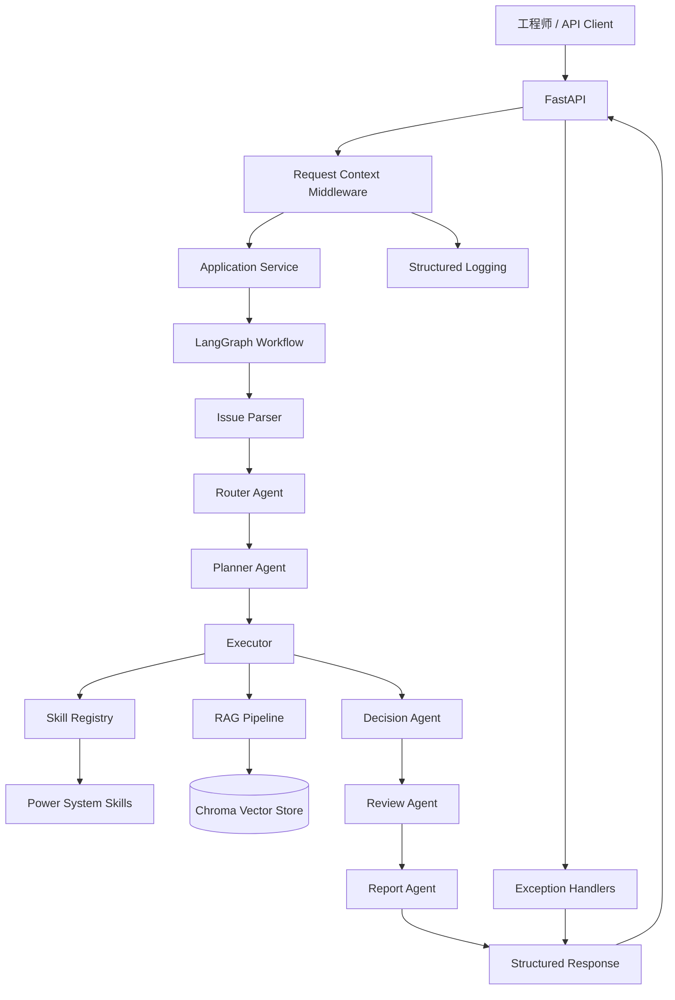

# PowerAgent

面向动力系统数智化管理的多 Agent 工作流平台。

PowerAgent 围绕动力电池、充电、热管理和电驱研发场景，将动力系统问题解析、知识检索、数据分析、候选诊断、数字孪生预测、参数寻优、模拟策略下发、研发分析、人工复核和报告生成组织为统一的 Agent 系统工程闭环。

## 1. 项目背景

动力系统研发与运维通常存在以下问题：

- 知识文档分散，工程经验难以复用；
- 电池、充电和热管理分析流程重复；
- 诊断、实验设计和跨团队协同高度依赖人工经验；
- 大模型直接回答容易缺乏证据、边界和可追踪性；
- 算法原型缺少统一 API、测试、评测、日志和部署方式。

PowerAgent 不是普通聊天机器人，也不直接控制真实车辆或设备。项目重点是构建具备严格数据契约、工具调用、证据约束、人工审核和工程部署能力的多 Agent 平台。

## 2. 核心能力

- 使用 DeepSeek 将自然语言转换为结构化动力系统问题；
- 使用 Router、Planner、Decision、Review 和 Report Agent 编排任务；
- 使用 Skill Registry 管理可复用动力系统 Skills；
- 使用 Chroma 构建可动态更新的动力系统 RAG 知识库；
- 支持 Markdown、TXT 和文本型 PDF 文档上传、切分、入库和删除；
- 支持动力电池、充电和热管理数据分析；
- 支持规则驱动的候选故障诊断；
- 支持简化数字孪生预测、参数寻优和模拟云端策略下发；
- 支持研发问题的根因假设、验证实验、团队任务和风险分析；
- 使用 Review Agent 约束证据、结论和人工复核边界；
- 使用 FastAPI 暴露统一 HTTP API；
- 使用 Request ID、Trace ID 和 JSON 日志实现可观测性；
- 使用 pytest、模块评测和 Smoke Test 建立质量闭环；
- 使用 Docker 和 Docker Compose 完成容器化部署。

## 3. 技术栈

```text
Python
Pydantic
DeepSeek API
Prompt Engineering
Structured Output
Tool Calling
LangGraph
FastAPI
Chroma
RAG
pytest
httpx
Docker
Docker Compose
JSON Structured Logging
```

## 4. 系统架构



完整架构说明见：

```text
docs/architecture.md
```

## 5. Agent 角色

| Agent | 职责 |
|---|---|
| Issue Parser | 将用户自然语言转换为结构化动力系统问题 |
| Router Agent | 判断任务类型和当前可执行状态 |
| Planner Agent | 根据 Skill Registry 生成执行计划 |
| Decision Agent | 决定继续、重试、重规划、人工复核或结束 |
| Review Agent | 审核工具结果、RAG 证据、风险和结论 |
| Report Agent | 将审核结果整理为结构化最终报告 |

研发分析工作流在通用工作流之上生成：

```text
候选根因
验证实验
团队任务
协作依赖
研发风险
人工复核要求
```

## 6. 可复用 Skills

当前主要 Skills 包括：

```text
Knowledge Skill
Battery Analysis Skill
Thermal Analysis Skill
Charging Analysis Skill
Diagnosis Skill
Digital Twin Skill
Optimization Skill
Cloud Dispatch Skill
Report Generation Skill
```

所有 Skills 使用统一的输入模型、输出模型、执行上下文和异常边界，并由 Skill Registry 统一注册和调用。

## 7. 工作流

### 通用动力系统工作流

```text
用户问题
→ Issue Parser
→ Router
→ Planner
→ RAG / Skills
→ Decision
→ Review
→ Report
→ 结构化响应
```

支持：

```text
knowledge_query
data_analysis
fault_diagnosis
parameter_optimization
report_generation
```

### 研发分析工作流

```text
研发问题
→ 通用工作流获取可信上下文
→ 提取审核后事实和缺失信息
→ 生成候选根因
→ 设计验证实验
→ 生成团队任务和协作依赖
→ 识别研发风险
→ 输出结构化研发分析结果
```

## 8. Request ID 与 Trace ID

`Request ID` 用于追踪一次 HTTP 请求：

```text
客户端请求
→ FastAPI
→ 异常处理
→ 响应头
→ 访问日志
```

`Trace ID` 用于追踪一次 Agent 工作流：

```text
问题解析
→ 路由
→ 规划
→ 工具或 RAG
→ 决策
→ 审核
→ 报告
```

知识库状态查询等非 Agent 接口可以只有 Request ID，而没有 Trace ID。

## 9. HTTP 失败与业务失败

### HTTP 或系统失败

以下情况使用 4xx 或 5xx：

```text
请求字段不合法
上传格式错误
上传文件过大
文档冲突
资源不存在
LLM认证失败
LLM限流
依赖初始化失败
未处理系统异常
```

### 结构化业务失败

以下情况通常仍返回 HTTP 200：

```text
证据不足
需要人工复核
报告生成被阻断
工作流未形成可信结论
研发方案执行失败但已形成结构化失败结果
```

调用方应同时检查：

```text
HTTP status
response.status
data.status
needs_human_review
failure_reason
```

## 10. 项目目录

```text
PowerAgent/
├── agent_core/          # Agent、LLM、Tool Calling和工作流核心
├── app/                 # FastAPI、配置、依赖装配、服务和异常处理
├── rag/                 # 文档、切分、Embedding、Chroma和检索
├── skills/              # 可复用动力系统Skills
├── workflows/           # 通用工作流扩展和研发分析工作流
├── report/              # 研发报告模板
├── evaluation/          # 测试集、模块评测和统一质量看板
├── examples/            # 功能Demo、API客户端和Smoke Test
├── tests/               # pytest自动化测试
├── scripts/             # 知识库和项目辅助脚本
├── docs/                # 知识语料、架构、演示和验收文档
├── data/                # 本地Chroma和运行数据，不提交
├── logs/                # 本地结构化日志，不提交
├── Dockerfile
├── docker-compose.yml
├── .dockerignore
├── .env.example
├── requirements.txt
└── README.md
```

## 11. 环境要求

```text
Python 3.14
Docker Desktop
Docker Compose
DeepSeek API Key
```

## 12. 本地安装

创建并激活虚拟环境：

```powershell
python -m venv .venv

.\.venv\Scripts\Activate.ps1
```

安装依赖：

```powershell
python -m pip install `
  --upgrade pip

python -m pip install `
  -r requirements.txt
```

## 13. 环境变量

复制模板：

```powershell
Copy-Item `
  ".env.example" `
  ".env"
```

至少填写：

```dotenv
DEEPSEEK_API_KEY=真实密钥
DEEPSEEK_BASE_URL=https://api.deepseek.com
DEEPSEEK_MODEL=实际模型名称
```

禁止提交 `.env`，禁止在代码、日志和文档中保存真实 API Key。

离线测试推荐：

```dotenv
POWERAGENT_EMBEDDING_BACKEND=hash
```

本地真实知识检索可使用：

```dotenv
POWERAGENT_EMBEDDING_BACKEND=chroma_default
```

## 14. 本地启动

```powershell
python -m uvicorn `
  app.main:app `
  --host 127.0.0.1 `
  --port 8000
```

Swagger：

```text
http://127.0.0.1:8000/docs
```

OpenAPI：

```text
http://127.0.0.1:8000/openapi.json
```

## 15. Docker 启动

构建并启动：

```powershell
docker compose up `
  -d `
  --build
```

查看状态：

```powershell
docker compose ps
```

健康状态应为：

```text
Up ... (healthy)
```

查看日志：

```powershell
docker compose logs `
  --tail 100 `
  api
```

停止并保留持久化卷：

```powershell
docker compose down
```

## 16. API

| 方法 | 路径 | 功能 |
|---|---|---|
| GET | `/health/live` | 服务存活检查 |
| GET | `/health/ready` | 依赖就绪检查 |
| GET | `/api/v1/skills` | 查询 Skill 目录 |
| GET | `/api/v1/knowledge/status` | 查询知识库状态 |
| POST | `/api/v1/knowledge/documents` | 上传知识文档 |
| DELETE | `/api/v1/knowledge/documents/{document_id}` | 删除知识文档 |
| POST | `/api/v1/workflows/analyze` | 通用动力系统工作流 |
| POST | `/api/v1/rnd/analyze` | 研发分析工作流 |

## 17. API 客户端

健康检查：

```powershell
python -m examples.api_client_demo `
  health
```

查询 Skill：

```powershell
python -m examples.api_client_demo `
  skills
```

上传文档：

```powershell
python -m examples.api_client_demo `
  document-upload `
  --file ".\example.txt" `
  --topic "高SOC快充" `
  --subsystem charging
```

通用分析：

```powershell
python -m examples.api_client_demo `
  workflow-analyze `
  --input "请基于知识库说明高SOC快充限流需要检查哪些因素" `
  --include-trace `
  --include-intermediate-results
```

研发分析：

```powershell
python -m examples.api_client_demo `
  rnd-analyze `
  --input "针对高SOC快充限流问题开展研发分析" `
  --affected-scope "部分车辆" `
  --available-data "充电电流" `
  --available-data "单体电压" `
  --deliverable "候选根因" `
  --deliverable "验证实验"
```

## 18. Smoke Test

本地或容器服务启动后执行：

```powershell
python -m examples.api_smoke_test `
  --base-url "http://127.0.0.1:8000"
```

调用真实工作流：

```powershell
python -m examples.api_smoke_test `
  --base-url "http://127.0.0.1:8000" `
  --timeout 120 `
  --include-workflows
```

## 19. 自动化测试

```powershell
python -m pytest -q
```

当前完整测试结果：

```text
213 passed
```

当前两条 warning 来自 FastAPI TestClient 和 Chroma 第三方依赖，不属于项目功能失败。

## 20. 评测

统一评测入口：

```powershell
python -m evaluation.run_all_evaluations
```

结果保存于：

```text
evaluation/results/
```

当前代表性结果：

| 模块 | 指标 | 结果 |
|---|---|---:|
| Issue Parser | API调用成功率 | 100% |
| Issue Parser | 任务类型准确率 | 100% |
| Issue Parser | 子系统准确率 | 91.67% |
| RAG | 文档命中率 | 100% |
| RAG | MRR | 1.0 |
| RAG | 引用合法率 | 100% |
| RAG | Pipeline错误率 | 0% |

评测结果用于暴露 Bad Case 和能力边界，而不是只展示单一高分。

## 21. 安全与人工审核边界

- 不执行真实设备控制；
- Cloud Dispatch 固定为模拟下发；
- 高风险、证据不足和失败状态必须保留人工复核；
- 不把模型假设自动升级为已确认根因；
- RAG 引用必须来自本次检索结果；
- 未知异常返回脱敏错误，不泄露堆栈和内部路径；
- 不记录 API Key、Authorization、请求正文或上传文件内容；
- Docker 镜像不包含 `.env`；
- 所有容器路径和持久化数据通过 Compose 管理。

## 22. 已知限制

- 数字孪生为简化预测模型，不替代标定后的高保真模型；
- 参数寻优为有限候选搜索，不直接替代生产控制策略；
- 默认 Chroma Embedding 首次运行可能需要模型缓存；
- LLM 输出具有非确定性，需要评测和人工复核；
- 当前采用单机 FastAPI 和单 Worker 部署；
- 尚未接入认证、权限、限流、队列和外部数据库；
- Markdown 和文本型 PDF 解析能力优先，扫描型 PDF 不在当前范围内。

## 23. 后续规划

- 增加身份认证和角色权限；
- 增加异步任务队列和长任务状态查询；
- 增加文档列表、版本和元数据管理；
- 接入真实动力系统数据平台；
- 增加模型、Prompt 和知识库版本追踪；
- 增加指标监控、分布式 Trace 和生产告警；
- 将模拟策略下发接入独立审批系统；
- 扩展更高保真数字孪生和优化算法。

## 24. 项目定位

PowerAgent 展示的不是单个 Prompt 或聊天机器人，而是一套围绕动力系统研发场景构建的 Agent 系统工程能力：

```text
场景建模
+ 严格Schema
+ Tool Calling
+ RAG
+ 多Agent工作流
+ 证据与审核
+ 评测
+ API
+ 日志
+ Docker部署
```